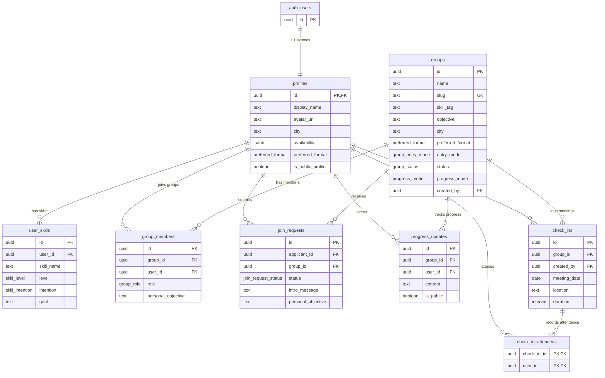

# Database Schema

Consolidated schema for Synedria MVP. All tables live in the `public` schema unless noted. Supabase Auth manages `auth.users` — our tables reference it via foreign keys.

> **Source**: Aggregated from specs 01-08 in `.development/specs/planned/`.

---

## Entity Relationship Diagram



---

## Enums

```sql
CREATE TYPE preferred_format AS ENUM ('in_person', 'hybrid', 'online');
CREATE TYPE skill_level      AS ENUM ('beginner', 'intermediate', 'advanced');
CREATE TYPE skill_intention   AS ENUM ('learn', 'teach', 'collaborate');
CREATE TYPE group_entry_mode  AS ENUM ('approval', 'open');
CREATE TYPE group_status      AS ENUM ('open', 'closed');
CREATE TYPE progress_mode     AS ENUM ('accumulation', 'deadline', 'both');
CREATE TYPE group_role        AS ENUM ('referent', 'member');
CREATE TYPE join_request_status AS ENUM ('pending', 'approved', 'rejected', 'expired');
```

> **Note:** `study_mode`, `climate`, and `expected_attendance` on the `groups` table are free text, not enums. The UI provides suggested values (e.g. "practical projects", "fairly informal") but users can write their own descriptions.

---

## Tables

### profiles

1:1 extension of `auth.users`. Created automatically on first OAuth login.

| Column | Type | Constraints | Notes |
| --- | --- | --- | --- |
| `id` | `uuid` | `PK, FK → auth.users(id) ON DELETE CASCADE` | Same ID as auth user |
| `display_name` | `text` | `NOT NULL` | Seeded from OAuth provider |
| `avatar_url` | `text` | | OAuth provider avatar URL |
| `city` | `text` | | Free text, e.g. "zona Navigli, Milano" |
| `availability` | `jsonb` | | `{"monday": ["morning", "evening"], ...}` |
| `preferred_format` | `preferred_format` | | |
| `is_public_profile` | `boolean` | `NOT NULL DEFAULT false` | If true, name/avatar visible to unauthenticated visitors on group pages |
| `created_at` | `timestamptz` | `NOT NULL DEFAULT now()` | |
| `updated_at` | `timestamptz` | `NOT NULL DEFAULT now()` | Updated via trigger |

**RLS policies:**

- `SELECT`: Authenticated users can read profiles of members in their groups. Public profile data (name, avatar) readable by anyone when `is_public_profile = true`.
- `INSERT`: Users can insert their own profile (id = auth.uid()).
- `UPDATE`: Users can update only their own profile.
- `DELETE`: Users can delete only their own profile.

---

### user_skills

Per-skill entries for a user. A user can have multiple skills with different levels and intentions.

| Column | Type | Constraints | Notes |
| --- | --- | --- | --- |
| `id` | `uuid` | `PK DEFAULT gen_random_uuid()` | |
| `user_id` | `uuid` | `NOT NULL, FK → profiles(id) ON DELETE CASCADE` | |
| `skill_name` | `text` | `NOT NULL` | Free text with autocomplete from existing values |
| `level` | `skill_level` | `NOT NULL` | |
| `intention` | `skill_intention` | `NOT NULL` | |
| `goal` | `text` | | Optional, e.g. "get AWS cert by June" |
| `created_at` | `timestamptz` | `NOT NULL DEFAULT now()` | |

**Indexes:**

- `idx_user_skills_user_id` on `(user_id)`
- `idx_user_skills_skill_name` on `(lower(skill_name))` — for case-insensitive search/autocomplete

**RLS policies:**

- `SELECT`: Same as profiles — visible in group membership context.
- `INSERT`, `UPDATE`, `DELETE`: Owner only (user_id = auth.uid()).

---

### groups

Study groups. Public by default, SEO-indexable.

| Column | Type | Constraints | Notes |
| --- | --- | --- | --- |
| `id` | `uuid` | `PK DEFAULT gen_random_uuid()` | |
| `name` | `text` | `NOT NULL` | |
| `slug` | `text` | `NOT NULL UNIQUE` | URL-friendly, generated from name. Collisions resolved with numeric suffix |
| `skill_tag` | `text` | `NOT NULL` | Same tag system as user_skills |
| `objective` | `text` | `NOT NULL` | Free text description of the group's goal |
| `roadmap_url` | `text` | | Optional external link |
| `city` | `text` | `NOT NULL` | Free text |
| `preferred_format` | `preferred_format` | `NOT NULL` | |
| `entry_mode` | `group_entry_mode` | `NOT NULL DEFAULT 'approval'` | |
| `status` | `group_status` | `NOT NULL DEFAULT 'open'` | |
| `progress_mode` | `progress_mode` | `NOT NULL DEFAULT 'accumulation'` | |
| `deadline` | `date` | | Only relevant when progress_mode includes 'deadline' |
| `meeting_place` | `text` | | Optional recurring location |
| `study_mode` | `text` | | Free text with UI suggestions (e.g. "practical projects", "Q&A turns") |
| `climate` | `text` | | Free text with UI suggestions (e.g. "fairly informal", "absolute focus") |
| `expected_attendance` | `text` | | Free text with UI suggestions (e.g. "every meeting", "flexible") |
| `description` | `text` | | Free-form additional description |
| `is_indexable` | `boolean` | `NOT NULL DEFAULT true` | Referent can toggle SEO indexing |
| `created_by` | `uuid` | `NOT NULL, FK → profiles(id)` | Group creator |
| `created_at` | `timestamptz` | `NOT NULL DEFAULT now()` | |
| `updated_at` | `timestamptz` | `NOT NULL DEFAULT now()` | Updated via trigger |

**Indexes:**

- `idx_groups_slug` on `(slug)` — unique already covers this
- `idx_groups_skill_tag` on `(lower(skill_tag))` — for search
- `idx_groups_city` on `(lower(city))` — for search
- `idx_groups_status` on `(status)` — filter open groups

**RLS policies:**

- `SELECT`: Public data readable by anyone (anonymous included) — group pages are public.
- `INSERT`: Any authenticated user with a complete profile.
- `UPDATE`: Referent only (checked via group_members.role).
- `DELETE`: None in MVP (groups can be closed, not deleted).

---

### group_members

Junction table linking users to groups. Tracks role and join date.

| Column | Type | Constraints | Notes |
| --- | --- | --- | --- |
| `id` | `uuid` | `PK DEFAULT gen_random_uuid()` | |
| `group_id` | `uuid` | `NOT NULL, FK → groups(id) ON DELETE CASCADE` | |
| `user_id` | `uuid` | `NOT NULL, FK → profiles(id) ON DELETE CASCADE` | |
| `role` | `group_role` | `NOT NULL DEFAULT 'member'` | Exactly one 'referent' per group |
| `personal_objective` | `text` | | Declared when joining (from join request) |
| `joined_at` | `timestamptz` | `NOT NULL DEFAULT now()` | |

**Constraints:**

- `UNIQUE (group_id, user_id)` — a user can only be a member once per group

**Indexes:**

- `idx_group_members_group_id` on `(group_id)`
- `idx_group_members_user_id` on `(user_id)`

**RLS policies:**

- `SELECT`: Public (member count). Member details (names, objectives) only for authenticated users who are members of the same group, OR for users with `is_public_profile = true`.
- `INSERT`: Via join request approval or direct join (open groups). Application logic enforces the 8-member hard limit.
- `UPDATE`: Referent can update roles (for referent transfer).
- `DELETE`: A member can remove themselves (leave). Referent cannot remove others in MVP.

**Application-level invariants:**

- Max 8 members per group (enforced on insert).
- Exactly one referent per group. On referent departure without transfer, longest-standing member is auto-promoted.

---

### join_requests

Join request flow for groups with active approval.

| Column | Type | Constraints | Notes |
| --- | --- | --- | --- |
| `id` | `uuid` | `PK DEFAULT gen_random_uuid()` | |
| `applicant_id` | `uuid` | `NOT NULL, FK → profiles(id) ON DELETE CASCADE` | |
| `group_id` | `uuid` | `NOT NULL, FK → groups(id) ON DELETE CASCADE` | |
| `status` | `join_request_status` | `NOT NULL DEFAULT 'pending'` | |
| `intro_message` | `text` | | Optional, max ~500 chars |
| `personal_objective` | `text` | `NOT NULL` | Why the user wants to join |
| `created_at` | `timestamptz` | `NOT NULL DEFAULT now()` | |
| `resolved_at` | `timestamptz` | | When approved/rejected/expired |
| `resolved_by` | `uuid` | `FK → profiles(id)` | Who approved/rejected (null if expired) |

**Indexes:**

- `idx_join_requests_group_id_status` on `(group_id, status)` — referent dashboard queries
- `idx_join_requests_applicant_id` on `(applicant_id)` — applicant's request list

**RLS policies:**

- `SELECT`: Applicant can read their own requests. Referent can read requests for their groups.
- `INSERT`: Authenticated users. Application logic checks: not already a member, no pending request, group not full, group not closed.
- `UPDATE`: Referent of the target group only (approve/reject).
- `DELETE`: None (requests are stateful, not deletable).

**Expiration:**

- Pending requests older than 5 days are auto-expired. Implemented either as:
  - A scheduled Supabase cron job that updates status, or
  - A query-time check (`WHERE status = 'pending' AND created_at > now() - interval '5 days'`)

---

### check_ins

Lightweight meeting records. One per group per day.

| Column | Type | Constraints | Notes |
| --- | --- | --- | --- |
| `id` | `uuid` | `PK DEFAULT gen_random_uuid()` | |
| `group_id` | `uuid` | `NOT NULL, FK → groups(id) ON DELETE CASCADE` | |
| `created_by` | `uuid` | `NOT NULL, FK → profiles(id)` | Member who recorded the check-in |
| `meeting_date` | `date` | `NOT NULL` | Defaults to today, backdatable up to 7 days |
| `location` | `text` | | Approximate location or "online" |
| `duration` | `interval` | | e.g. '1.5 hours' |
| `created_at` | `timestamptz` | `NOT NULL DEFAULT now()` | |
| `updated_at` | `timestamptz` | `NOT NULL DEFAULT now()` | Editable within 48h of creation |

**Constraints:**

- `UNIQUE (group_id, meeting_date)` — one check-in per group per day

**Indexes:**

- `idx_check_ins_group_id` on `(group_id)` — meeting log queries
- `idx_check_ins_meeting_date` on `(group_id, meeting_date DESC)` — reverse chronological listing

**RLS policies:**

- `SELECT`: Public (meeting log is visible on the public group page).
- `INSERT`: Group members only. Application logic enforces: meeting_date >= now() - 7 days.
- `UPDATE`: Creator only, within 48h of creation.
- `DELETE`: None (check-ins are permanent records).

---

### check_in_attendees

Junction table recording who attended each meeting.

| Column | Type | Constraints | Notes |
| --- | --- | --- | --- |
| `check_in_id` | `uuid` | `NOT NULL, FK → check_ins(id) ON DELETE CASCADE` | |
| `user_id` | `uuid` | `NOT NULL, FK → profiles(id) ON DELETE CASCADE` | |

**Constraints:**

- `PK (check_in_id, user_id)` — composite primary key

**RLS policies:**

- `SELECT`: Public in aggregate (attendee count). Individual names visible to group members only, or to anyone if the attendee has `is_public_profile = true`.
- `INSERT`, `UPDATE`, `DELETE`: Same permissions as the parent check_in (creator, within 48h).

---

### progress_updates

Personal progress entries by group members. Separate from check-ins.

| Column | Type | Constraints | Notes |
| --- | --- | --- | --- |
| `id` | `uuid` | `PK DEFAULT gen_random_uuid()` | |
| `group_id` | `uuid` | `NOT NULL, FK → groups(id) ON DELETE CASCADE` | |
| `user_id` | `uuid` | `NOT NULL, FK → profiles(id) ON DELETE CASCADE` | |
| `content` | `text` | `NOT NULL` | Free text progress note |
| `is_public` | `boolean` | `NOT NULL DEFAULT false` | Member can make public at end of group journey |
| `created_at` | `timestamptz` | `NOT NULL DEFAULT now()` | |

**Indexes:**

- `idx_progress_updates_group_id` on `(group_id, created_at DESC)`
- `idx_progress_updates_user_id` on `(user_id)`

**RLS policies:**

- `SELECT`: Group members can read all updates for their group. Others can read only `is_public = true` updates.
- `INSERT`: Group members only.
- `UPDATE`: Owner only (user_id = auth.uid()). Can toggle `is_public`.
- `DELETE`: Owner only.

---

## Account Deletion (GDPR)

When a user deletes their account (spec 01, FR-15 to FR-20):

1. `profiles` row is deleted (CASCADE propagates to `user_skills`).
2. `group_members` rows are deleted (user leaves all groups).
3. `check_ins.created_by` — needs handling: either set to null or to a sentinel "deleted user" UUID.
4. `check_in_attendees` rows for the user are deleted.
5. `progress_updates` where `is_public = true` are anonymized (user_id set to null or sentinel). Private updates are deleted.
6. `join_requests` for the user are deleted.

> **Implementation note:** Use a combination of `ON DELETE CASCADE` and a pre-deletion function that handles anonymization before the cascade fires.

---

## Triggers

### updated_at auto-update

```sql
-- Reusable trigger function
CREATE OR REPLACE FUNCTION update_updated_at()
RETURNS TRIGGER AS $$
BEGIN
  NEW.updated_at = now();
  RETURN NEW;
END;
$$ LANGUAGE plpgsql;

-- Apply to tables with updated_at
CREATE TRIGGER set_updated_at BEFORE UPDATE ON profiles
  FOR EACH ROW EXECUTE FUNCTION update_updated_at();

CREATE TRIGGER set_updated_at BEFORE UPDATE ON groups
  FOR EACH ROW EXECUTE FUNCTION update_updated_at();

CREATE TRIGGER set_updated_at BEFORE UPDATE ON check_ins
  FOR EACH ROW EXECUTE FUNCTION update_updated_at();
```

### Profile auto-creation on signup

```sql
-- Create a profile row when a new user signs up via Supabase Auth
CREATE OR REPLACE FUNCTION handle_new_user()
RETURNS TRIGGER AS $$
BEGIN
  INSERT INTO public.profiles (id, display_name, avatar_url)
  VALUES (
    NEW.id,
    COALESCE(NEW.raw_user_meta_data->>'full_name', NEW.raw_user_meta_data->>'name', 'User'),
    COALESCE(NEW.raw_user_meta_data->>'avatar_url', NEW.raw_user_meta_data->>'picture')
  );
  RETURN NEW;
END;
$$ LANGUAGE plpgsql SECURITY DEFINER;

CREATE TRIGGER on_auth_user_created
  AFTER INSERT ON auth.users
  FOR EACH ROW EXECUTE FUNCTION handle_new_user();
```

---

## Design Decisions

1. **UUIDs everywhere**: Consistent with Supabase Auth (`auth.users.id` is UUID). No serial/integer PKs.
2. **Free text for skills and cities**: MVP simplicity. Normalized tag/city tables can come later without schema-breaking changes.
3. **JSONB for availability**: Flexible structure (`{"monday": ["morning", "evening"]}`), avoids a complex availability table. Queryable with PostgreSQL JSON operators.
4. **Enums over check constraints**: Clearer intent, better error messages, IDE-friendly. Trade-off: adding enum values requires a migration (but this is rare for these domains).
5. **No soft deletes**: Groups can be closed (status change) but not deleted. Check-ins are permanent. This keeps the schema simple and the data trustworthy.
6. **`duration` as interval**: PostgreSQL's `interval` type handles "1 hour 30 minutes" natively. Alternative: `smallint` storing minutes — simpler but less expressive.

---

## Open Questions (Carried from Specs)

These questions affect the schema and should be resolved before writing migrations:

| # | Question | Source | Schema Impact |
| --- | --- | --- | --- |
| 1 | Free text vs curated skill tags? | Spec 02 | If curated: add a `skill_tags` lookup table and FK from `user_skills.skill_name` and `groups.skill_tag` |
| 2 | Multiple cities per user? | Spec 02 | If yes: extract `city` to a separate `user_cities` table |
| 3 | Max tags per group? | Spec 04 | If multiple: replace `groups.skill_tag` (text) with a `group_tags` junction table |
| 4 | Group deletion vs close-only? | Spec 04 | If deletable: add soft-delete column or allow hard delete with cascade |
| 5 | Re-application cooldown after rejection? | Spec 07 | If yes: add a check constraint or application-level rule on `join_requests` |
| 6 | `duration` type: interval vs integer (minutes)? | Spec 08 | Affects check_ins.duration column type |
